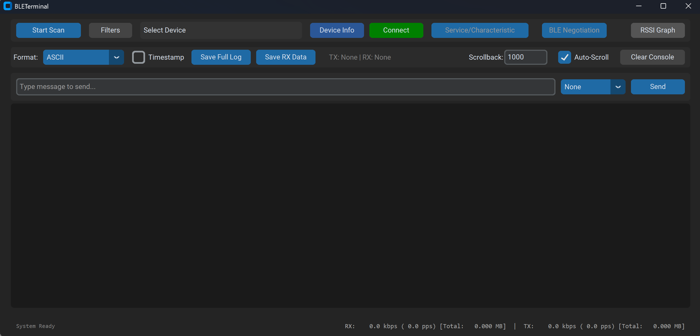

# BLETerminal

## Version
2.0.1

## Description
The BLETerminal is a terminal for connecting to BLE devices.

## Features
- Service/Characteristic selection
- Filter scanned BLE devices
- Multiple display format options: ASCII/UTF-8/Hex (Compact)/Hex/Binary
- Multiple save options: Save full log/Save RX data
- Transmit data with EOL options
- Clear Console
- RSSI graph
- Device information of scanned devices is now available

## Usage
1. Open BLETerminal.exe
2. Click "Scan" to scan for BLE devices
3. (Optional) Filter scanned BLE devices
4. (Optional) Click on RSSI Graph to view the RSSIs of scanned BLE devices
5. Click on "Select a device..." to open the drop down menu, select the target BLE device, then click on "Connect"
6. Click on "Service/Characteristic" to select the service and characteristics you would like to connect to
7. (Optional) Save the console's output
8. Click "Disconnect" to disconnect from the target BLE device

